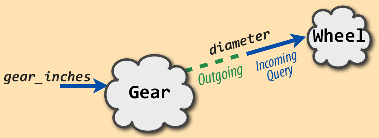
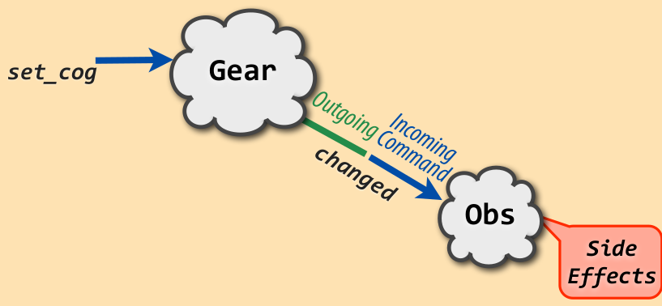

# Magic Tricks of Testing (summary) Sandy Metz

## Incoming

### Incoming Query  <span style="color:green">(Assert Result)</span>

``` python
class Whell:
    def __init__(self, rim, tire):
        self.rim = rim
        self.tire = tire

    def diameter(self):
        return self.rim + (self.tire * 2)


class TestWheel:
    def test_calculates_diameter(self):
        wheel = Whell(26, 1.5)

        assert wheel.diameter() == 29
        ## ⬆ Test the return value (result)
```

### Incoming (private) Query

``` python
class Wheel:
    def __init__(self, rim, tire):
        self.rim = rim
        self.tire = tire

    def diameter(self):
        return self.rim + (self.tire * 2)

class Gear:
    def __init__(self, chainring, cog, wheel):
        self.chainring = chainring
        self.cog = cog
        self.wheel = wheel

    def _ratio(self):
        return self.chainring / self.cog

    def gear_inches(self):
        return self._ratio() * self.wheel.diameter()  # call private method


class TestGear:
    def test_calculates_gear_inches(self):
        wheel = Wheel(26, 1.5)
        gear = Gear(52, 11, wheel)

        assert gear.gear_inches() == pytest.approx(137, 0.01)
        ## ⬆ test the interface, not the implementation
        ## (without private function)
```

### Incoming Command <span style="color:green">(Assert public side effect)</span>

``` python
class Gear:
    def __init__(self):
        self.cog = 0

    def get_cog(self):
        return self.cog

    def set_cog(self, cog):
        self.cog = cog


class TestGear:
    def test_set_cog(self):
        gear = Gear()
        gear.set_cog(27)

        assert gear.cog == 27
        ## ⬆ assert public side effect
```

## To Self

### Sent to self <span style="color:red">(Ignore)</span>

``` python
class Wheel:
    def __init__(self, rim, tire):
        self.rim = rim
        self.tire = tire

    def diameter(self):
        return self.rim + (self.tire * 2)


class Gear:
    def __init__(self, chainring, cog, wheel):
        self.chainring = chainring
        self.cog = cog
        self.wheel = wheel

    def _ratio(self):
        return self.chainring / self.cog

    def gear_inches(self):
        return self._ratio() * self.wheel.diameter()  # call private method


class TestGear:
    def test_calculates_ratio(self): ## ⬅ test private method
        wheel = Wheel(26, 1.5)
        gear = Gear(52, 11, wheel)

        assert gear._ratio == pytest.approx(4.7, 0.01) ## call to self
        ## ⬆ this is redundant test. `gear_inches` return value is proof enough
        ## don’t test private method (assert / expectation). Don’t!
```

## Outgoing

### Outgoing Query <span style="color:red">(Ignore)</span>

<p align="center">
    
</p>


``` python
class Wheel:
    def __init__(self, rim, tire):
        self.rim = rim
        self.tire = tire

    def diameter(self):
        return self.rim + (self.tire * 2)


class Gear:
    def __init__(self, chainring, cog, wheel):
        self.chainring = chainring
        self.cog = cog
        self.wheel = wheel

    def _ratio(self):
        return self.chainring / self.cog

    def gear_inches(self):
        return self._ratio() * self.wheel.diameter()  # call other class (outgoing)


class TestGear:
    def test_calculates_gear_inches(self):
        wheel = Wheel(26, 1.5)
        gear = Gear(52, 11, wheel)

        # test outgoing command `wheel.diameter()`
        assert gear.wheel.diameter() == 29
        ## ⬆ this is already done in `Wheel` test (redundant)
```

### Outgoing Command <span style="color:blue">(Expect to send)</span>

<p align="center">
    
</p>

``` python
# assert someting (side effect) in far away.
# This is not `Gear` responsibility.
# This is an integration test, not unit test.
```

## Credits

https://www.youtube.com/watch?v=URSWYvyc42M

https://speakerdeck.com/skmetz/magic-tricks-of-testing-railsconf
